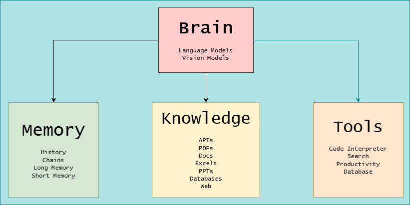

# Agentic AI

The framework of Agentic AI

1. Brain: The brain consists of a AI model which can be a Language Model or a Vision Model. Examples are GPT4o, LLAMA, DALL-E and so on.
For more info: [LLM](https://python.langchain.com/docs/integrations/providers/)
2. Memory: The memory consists of the conversations or the data which can be used as a context for upcoming questions/conversations.
For more info: [Memory](https://langchain-ai.github.io/langgraph/concepts/memory/)
3. Knowledge: Knowledge or Knowledge Base is a data which is used to generate a response. The KB can be anything from a API, CSV File, PDF to a database.
For more info: 
- [Retrivers](https://python.langchain.com/docs/integrations/retrievers/)
- [Vector Stores](https://python.langchain.com/docs/integrations/vectorstores/)
- [Document Loaders](https://python.langchain.com/docs/integrations/document_loaders/)
4. Tools: Tools are nothing but a utilities which can perform several function such as running a python code or searching a web.
For more info: [Tools](https://python.langchain.com/docs/integrations/tools/)